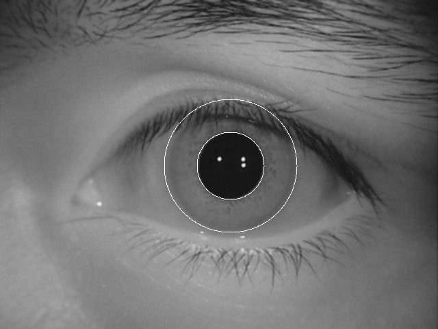
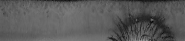

# BurningEyes
## iris recognition program accoding to John Daugman's papaers.
## Envonriment:Qt Creator 5.6 + OpenCV244
## references:
## [1]John Daugman. High Confidence Visual Recognition of Persons by a test of Statistical Independence[J].IEEE Trans Pattern Analysis and Machine Intelligence,1993,15(11):1148-1161 
## [2]John Daugman. Statistical richness of visual phase information: Update on recognizing persons by their iris patterns.Computer Vision,2001,45(1):25–38
##
##